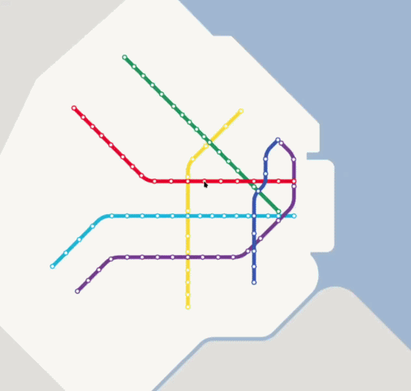

# [demo.transit.ar](https://demo.transit.ar)
WIP demo of a schematic transport map that becomes geographic as you zoom in.

*Currently incomplete and does not work well on phones, UHD/Retina screens, or Firefox.*
*Hosted at [demo.transit.ar](https://demo.transit.ar)*

 

**How it works** 

Each element of the map has a different position for each zoom level. When zooming in or out, [IDW](https://en.wikipedia.org/wiki/Inverse_distance_weighting) is done over the stations to calculate where the camera should move so that the closest ones maintain their positions relative to it. 
Lines and stations are represented in vector form and are interpolated when zooming. The rest of the details (streets and their names, buildings, etc.) are shown in the background in rasterized tiles prepared with [QGIS](https://qgis.org/), styled with [Maputnik](https://github.com/maplibre/maputnik), and generated with [TileServer-GL](https://github.com/maptiler/tileserver-gl). 
Everything is rendered using the HTML canvas.

**Libraries used** 
[protomaps/pmtiles](https://github.com/protomaps/pmtiles) for using rasterized tiles in pmtiles format. This is only used for testing, because no browser seems to handle HTML partial requests well. 
[kriszyp/msgpackr](https://github.com/kriszyp/msgpackr) to serialize stations and lines.

**Data sources for the map** 
The rasterized tiles have an OSM base with [sidewalks](https://data.buenosaires.gob.ar/dataset/veredas) and [parcels](https://web.archive.org/web/20200709054813/https://data.buenosaires.gob.ar/dataset/parcelas) from BA Data overlaid on top. These two are from 2019, since the former have not been updated since that year, and the data for the latter got much worse in quality starting in 2020. 
The schematic map is based on the [official integrated transport map](https://enelsubte.com/noticias/buenos-aires-ya-tiene-su-primer-mapa-unificado-de-transporte/), although the idea would be to replace it with a more suitable one once the technical part is complete.

**Development** 
Currently there is no easy way to make other maps with the code. 
I started doing tests at the end of 2025 with the intention of making a map that had a graph with all the subway, train, and bus lines of the Buenos Aires Metropolitan Area, and could represent them geographically and schematically in a dynamic way. However, I started realizing that it would be complicated to represent everything as objects in Javascript without using a huge amount of memory or CPU, that the HTML canvas has limitations that are too big, and that the way both work makes it very hard to optimize the code. 
I thus decided to put together several of these tests into a simple demo of subways and trains of CABA to have something functional, and after finishing it rewrite everything from scratch in WebAssembly and WebGL. Because of this the data structures are not very efficient and the current code in general is not very clean.

**This project was not made with “vibe coding” or anything of the sort.**

---

**TODO** for the demo to be presentable

- Adjust the size of things on small and UHD screens
- Improve vectors for subway lines
- Rewrite maplayer so it cancels requests for tiles that are no longer visible
- Improve movement logic and make zoom continuous on touch screens
- Add station entrances
- Add trains, premetro and metrobuses
- Add minimal UI

**TODO** in the future to finish the demo

- Add ability to click on stations
- Diagnose low performance in Firefox
- Add an address search and propagate it to schematic levels
- Decouple the CABA map from the demo and add UI to change it
- Make UI to edit maps and document
- Clean up the code
- Replace the schematic map with a more suitable one
